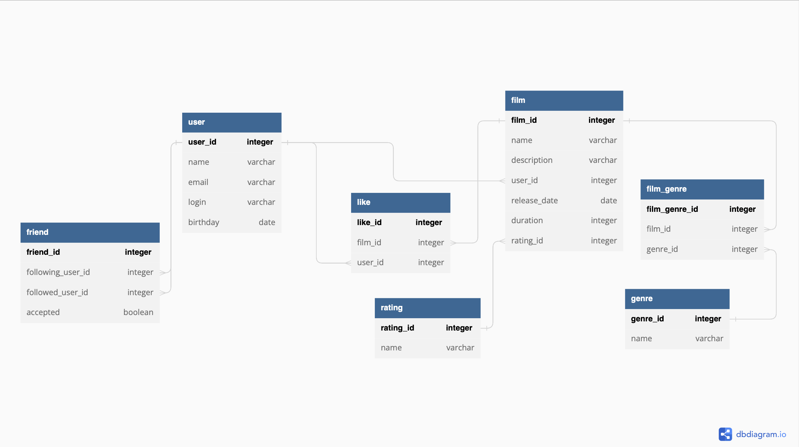

# java-filmorate

### 1. Схема Базы данных

* **user**

  Содержит информацию о пользователях
  - первичный ключ `user_id` - идентификатор пользователя
  - `name` - имя пользователя
  - `email` - почта пользователя
  - `login` - логин пользователя
  - `birthday` - дата рождения пользователя 

* **friend**

  Содержит информацию о заявках в друзья
  - первичный ключ `friend_id` - идентификатор заявки
  - `following_user_id` - идентификатор пользователя, которому был отправлен запрос в друзья
  - `followed_user_id` - идентификатор пользователя, который отправил запрос в друзья
  - `accepted` - статус принятия заявки

* **like**

  Содержит информацию о том какой пользователь поставил лайк какому фильму
  - первичный ключ `like_id` - идентификатор заявки
  - `film_id` - идентификатор фильма, которому был поставлен лайк
  - `user_id` - идентификатор пользователя, который поставил лайк

* **film**

  Содержит информацию о фильмах
  - первичный ключ `film_id` - идентификатор фильма
  - `name` - название фильма
  - `description` - описание фильма
  - `release_date` - дата релиза фильма
  - `duration` - длительность фильма в минутах
  - `rating_id` - идентификатор возрастного рейтинга фильма 

* **rating**

  Содержит информацию о возрастных рейтингах
  - первичный ключ `rating_id` - идентификатор рейтинга
  - `name` - наименование возрастного рейтинга

* **genre**

  Содержит информацию о жанрах
  - первичный ключ `genre_id` - идентификатор жанра
  - `name` - название жанра

* **film_genre**

  Содержит информацию о том какие жанры есть у фильма
  - первичный ключ `film_genre_id` - идентификатор жанра
  - `film_id` - идентификатор фильма
  - `genre_id` - идентификатор жанра

